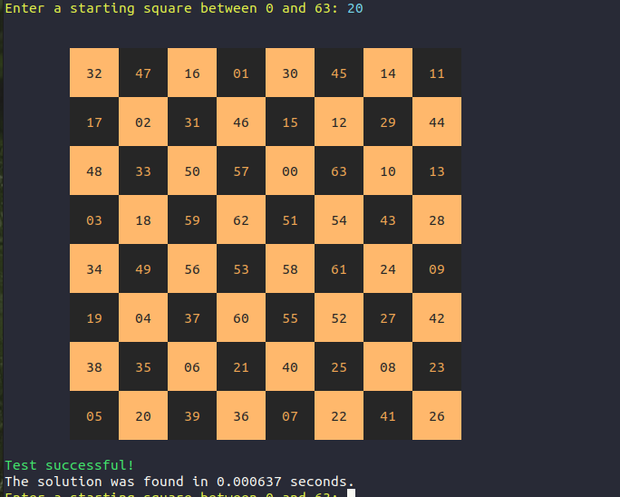
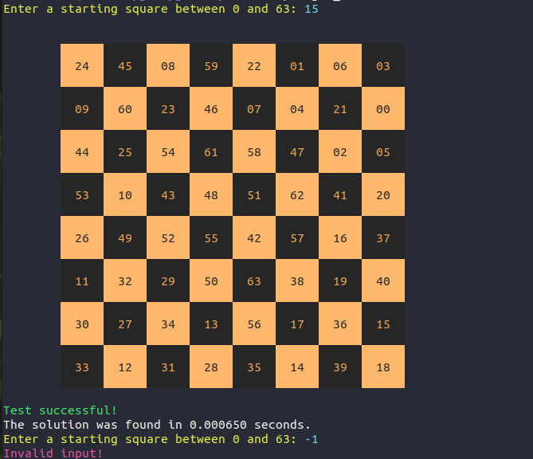
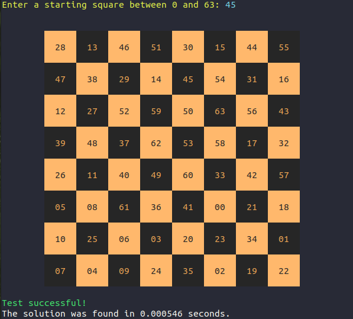

# The Knight’s Tour Problem – Backtracking Recursive Solutions



# Introduction

The knight’s tour puzzle is played on a chess board with a single chess piece, the knight. 

A knight is placed on any square of an empty board and, moving according to the rules of chess, must visit each square exactly once, like so:

 

The Knight’s Tour is actually a mathematical (Hamiltonian Path) problem dating back centuries.  Many solutions have 
been proposed, ranging from brute force algorithms to neural networks.

# Data Structure

Since every square on the board can be either visited or not, and there are 64 squares (for a standard chess board 8X8), we can use a **Bit Array**.

I have implemented a bit array that will be used in this program: [API](./api/bit_array.h), [Source code](./src/bit_array.c).

We will treat the chess board as 64 bits, which will be either 0 or 1 to indicate if the knight has visitied a certain sqaure on the board.
- '0' its the initial state of all the bits which means that no square has been visitied yet by the knight.
- '1' means the the square has been visited by the knight and **cannot be visited again in the same tour**.

# Validate Legal Position

**Each sqaure has 8 potential directions for the knight to go to.
But not all squares have 8 valid options because sometimes some of the steps will move the knight beyond board boundries 
i.e if we are looking at the chess board as a bit array whcih in 0 is first square on the board (top left corener) and 63 is the last square on the board (bottom right corner) so 65 is out of boundries as well as -1 and negative numbers.**
In my implementation, I use [`Cartesian to Index`](./src/knight_tour.c#L241) and [`Index to Cartesian`](./src/knight_tour.c#L233) converstion to convert indexes (0,1,2,...63) to (row,column) format.
For example:
* 0 -> 0,0
* 9 -> 1,1 (I start counting from 0).
* 0,1 -> 8

and in this way, its easier to check if the next move brings the knight to an illegal position (out of boundries for example if the row or column number is not in the range of 0-7) - [`IsPositionOutOfBoundsIMP`](./src/knight_tour.c#L220) and [`HasPositionBeenVisitedBeforeIMP`](./src/knight_tour.c#L226)


# Naive Algorithm - Brute Force Solution
  ## The implementation of this algorithm is the [`TourIMP` function](./src/knight_tour.c#L131).

The Naive Algorithm is to generate all tours one by one and check if the generated tour satisfies the constraints (a square can be visited only once and the knight must stay in board boundries).

Typically, we start from an empty bit map and one by one add moves and steps. When we add a move, we check if adding the square that the knight reached to violates the problem constraint, if it does then we try other alternatives. 

If none of the alternatives works out then we go to the previous stage and remove the square/step added in the previous stage. If we reach the initial stage back then we say that no solution exists. If adding a step that doesn’t violate constraints then we recursively add moves/squares one by one. If the solution bit map becomes complete (all bits are set - means all squares have been visited) then we print the solution.

The knight will start from an empty square and then just try each option out of the 8 potential future moves by [GetNextPositionIMP function](.src/knight_tour.c#L190).

The upper bound on the number of possible legal tours for an eight-by-eight chessboard is known to be .
However, there are even more possible dead ends. Clearly this is a some real computing power, or a lot of time.
There are `N^2` Cells and for each, we have a maximum of 8 possible moves to choose from, so the worst running time is `O(8N^2)`.
For that exact reason, I have also added a timeout of 2 minutes (or any other time if you want to change it) for finding a solution.

### Backtracking naive brute-force algorithm:

```
If timeout has reached
    terminate - no solution in reasonable time
If all squares are visited (all bits are set to 1)
    print the solution
If current square is illegal (out of boundries OR has been already visited)
    return failure
Else
   Mark this square as visited and return success.
   
   a) Recursively send the updated map to one of the next possible positions and check if it returns success.
      
   b) If the move chosen in the above step doesn't lead to a solution (returns failure),
   then try other alternative moves.
   
   c) If none of the alternatives work and every potential move returns failure, and no toure has been found, returns false to the user which means - no solution exists.
   
  ```
  
  # Warnsdorff’s Algorithm - Heuristic Solution
  
  Theheuristic solution proposed in 1823 by the German mathematician H.C. Warnsdorff that states the following simple rule: 
#### Always move the knight to an adjacent, unvisited square with minimal degree.
  
  #### For this soltion we are going to need 2 look up tables:
  * `possible_moves_lut` : which will indicate on how many possible legal moves are there from a given sqaure, i.e how many legal "exits" are there from a sqaure for the knight. Indexes are 0-63.
  * `next_positions_lut` : two dimensional array which will represent what are the legal squares that can be reached from a specific sqaure by a given direction. The first dimension is the square's index (0-63), and the second dimnesion is the direction (0-8 clockwise, i.e `0 = 2 steps up 1 left` and `1 == 2 steps up 1 right` and etc..
  e.g for `next_positions_lut[30][1]` for example we will get to sqaure `30` which is `(3,3)` we will go `2 steps up and 1 left` and will get to `(1,7)` -> `15`.
  so `next_positions_lut[30][1] == 15`.
  
  In this solution, the knight is moved so that it always proceeds to the square from which the knight will have the fewest onward moves.
  
  We will use the look up tables to 
  * find all possible future sqaures that the knight can get to from its current square
  * sort these positions from fewest to the square with the most onward moves.

### The lookup table construction is the [`CreatePossibleMovesLutIMP` function](./src/knight_tour.c#L258).

### And the final algorithm will be:

```
If all squares are visited (all bits are set to 1)
    print the solution
If current square is illegal (out of boundries OR has been already visited)
    return failure
Else
   Mark this square as visited and return success.
   
   count the number of legitimate possible moves out of 8.
   
   try each location from the sorted array by their order, so first loction knight will get to is the one with the fewest onward moves.
     
   a) Recursively send the updated map to one of the next possible positions and check if it returns success.
      
   b) If the move chosen in the above step doesn't lead to a solution (returns failure),
   then try other alternative moves.
   
   c) If none of the alternatives work and every potential move returns failure, and no toure has been found, returns false to the user which means - no solution exists.
   
  ```
  
 
  
  As you can see its the same algorithm as the brute force soltuion with one change - The knight doesn't randomly choose a direction and a step to go, but it chooses the next move based on which square has the feweset onward moves.
  
Starting from any square, the knight must move to an unvisited square that has the fewest successive moves.  
Choosing a square with the fewest successors avoids a possible dead-end when traversing the board.  However, 
because Warnsdorff’s rule is heuristic, it is not guaranteed to find a solution.

## The implementation of this algorithm is the [`HeuristicTourIMP` function](./src/knight_tour.c#L293).

# Compiling and Running

A [Makefile](./makefile) is available to compile and get an executable file which runs the [test file](./test_files/knight_tour_test.c), and represents
a visual solution of any received starting points along with the time it took to find it with the heuristic algorithm.

`make` or `make all` will build a `knight_tour` executable file which can run and asks the user to insert a start point for the knight's tour,
and then prints the solution as a chess board a number on each square.
Each number represents the numbers of step that it will take to the knight to get to that square.

```
00 is the first step
01 the second step
....
...
63 is the last step
```

## Screenshots of the program





 
 


  
  
  


